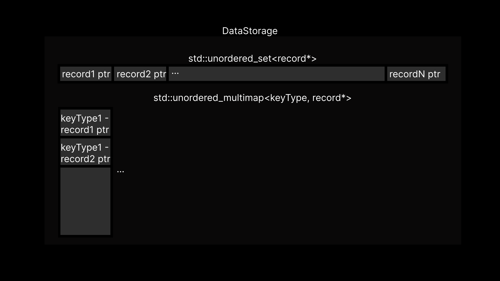

This is readme

Full documentation available [here](https://mrognor.github.io/DataStorage/index.html)

This project provides a convenient way to work with data.

Be careful when adding a string as a key value. If you do not specialize the function type manually, 
then the compiler will perceive your string as an array of charms, which may cause errors when adding and reading data.
Add examples.

Можно заменить или добавить схему на которой будет таблица
